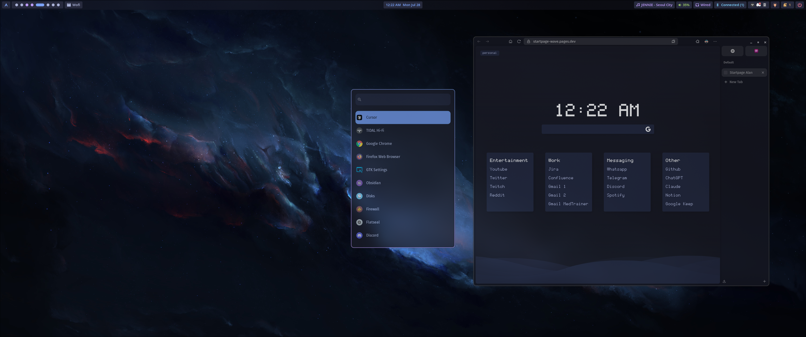
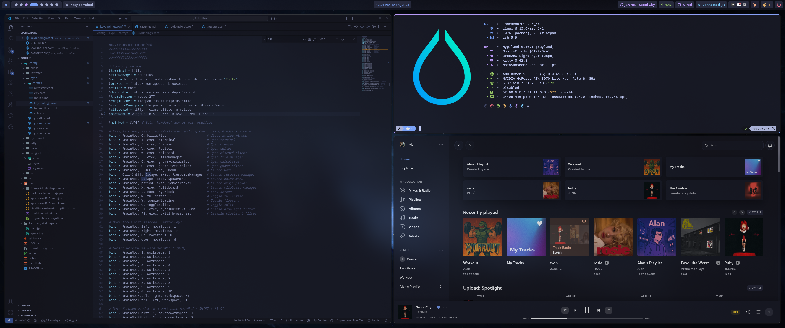

# 🌟 Alan's Arch Linux + Hyprland Dotfiles

My personal Arch Linux + Hyprland setup. This repository contains my versioned dotfiles, managed with [GNU Stow](https://www.gnu.org/software/stow/), allowing for a clean, modular, and easily replicable configuration.

<div align="center">

[](https://github.com/hyprwm/Hyprland)
[](https://archlinux.org/)

</div>

## 📸 Screenshots


<div align="center">
  
  
</div>

## 📦 Main Packages

### System Components

| Category | Packages |
|----------|----------|
| **Window Manager** | `hyprland` and ecosystem (`hyprpicker`, `hyprshot`, `hyprlock`, `hypridle`, `hyprpaper`, `hyprcursor`, `hyprsunset`, `hyprpolkitagent`, `xdg-desktop-portal-hyprland`, `hyprqt6engine`) |
| **Terminal & Shell** | `kitty`, `zsh`, `oh-my-zsh`, `neovim`, `paru`, `quickshell`, `noctalia-shell` |
| **Application Launcher** | `vicinae` |
| **System Utilities** | `wlogout`, `fastfetch`, `playerctl`, `solaar`, `kdeconnect`, `nautilus-admin-gtk4`, `nautilus-image-converter`, `nautilus-open-any-terminal`  |
| **Appearance** | `breezex-cursor-theme`, `numix-circle-icon-theme-git`, `ttf-fira-sans`, `gtk-engine-murrine`, `nwg-look`, `qt5-wayland`, `ttf-cascadia-mono-nerd`  |
| **Miscellaneous** | `stow` |    

### Flatpak

- Mission Center
- Gnome Music
- Celulloid
- Easy Effects

## 🛠️ Manual Installation

### 1. Install AUR Helper (paru)

```sh
# Install paru if not installed
sudo pacman -S --needed base-devel git
git clone https://aur.archlinux.org/paru.git
cd paru
makepkg -si
```

### 2. Install Required Packages

```sh
# Hyprland and related tools
paru -S --noconfirm \
  hyprland \
  hyprpicker \
  hyprshot \
  hyprlock \
  hypridle \
  hyprpaper \
  hyprcursor \
  hyprsunset \
  hyprpolkitagent \
  xdg-desktop-portal-hyprland \
  hyprland-qtutils \
  qt5-wayland \
  qt6-wayland \
  hyprqt6engine \
  quickshell \
  noctalia-shell \

# Terminal and system tools
paru -S --noconfirm \
  neovim \
  fastfetch \
  wlogout \
  solaar \
  playerctl \
  stow \
  zsh \
  nautilus-open-any-terminal \
  vicinae-bin \
  zoxide \
  eza \
  kdeconnect \
  yazi \
  7zip \
  resvg \
  ripdrag-git \
  cava \
  satty \

# Programs
paru -S --noconfirm \
  visual-studio-code-bin \
  zen-browser-bin \
  helium-browser-bin \
  tidal-hifi-bin \
  localsend-bin \
  vesktop-bin \
  obsidian-bin \
  mpv \

# Appearance
paru -S --noconfirm \
  breezex-cursor-theme \
  numix-circle-icon-theme-git \
  gtk-engine-murrine \
  ttf-fira-sans \
  ttf-jetbrains-mono-nerd \
  ttf-cascadia-mono-nerd \
  bongocat \
  adw-gtk-theme \
  nwg-look
```

### 3. Install Flatpak and Applications

```sh
# Install Flatpak
sudo pacman -S flatpak

# Add Flathub repository
flatpak remote-add --if-not-exists flathub https://flathub.org/repo/flathub.flatpakrepo

# Install applications
flatpak install flathub \
  io.missioncenter.MissionCenter \
  org.gnome.Music \
  com.github.wwmm.easyeffects \
```

### 4. Clone and Apply Dotfiles

```sh
git clone https://github.com/Alan7A/fedora-post-install.git ~/dotfiles && \
cd ~/dotfiles && \
stow .
```


### 5. Change Default Shell to Zsh

```sh
chsh -s /usr/bin/zsh
```

### 6. Install Oh-My-Zsh and plugins

```sh
# Install Oh-My-Zsh
sh -c "$(curl -fsSL https://raw.githubusercontent.com/ohmyzsh/ohmyzsh/master/tools/install.sh)"
# Powerlevel10k theme
git clone --depth=1 https://github.com/romkatv/powerlevel10k.git "${ZSH_CUSTOM:-$HOME/.oh-my-zsh/custom}/themes/powerlevel10k"
# zsh-autosuggestions
git clone https://github.com/zsh-users/zsh-autosuggestions ${ZSH_CUSTOM:-~/.oh-my-zsh/custom}/plugins/zsh-autosuggestions
# zsh-syntax-highlighting
git clone https://github.com/zsh-users/zsh-syntax-highlighting.git ${ZSH_CUSTOM:-~/.oh-my-zsh/custom}/plugins/zsh-syntax-highlighting
```

### Troubleshooting

---

#### Git configurations

```sh
git config --global init.defaultBranch main
git config --global core.editor "nvim"
git config --global user.email "you@example.com"
git config --global user.name "Your Name"
```
---

#### Fix dualboot showing different times

```sh
timedatectl set-local-rtc 1
```

---

#### Theme Flatpak apps

- This command makes flatpak apps to use the application's theme
  ```sh
  sudo flatpak override --filesystem=~/.themes
  ```
- Or you can use [stylepak](https://github.com/refi64/stylepak)

---

#### KDE Connect doesn't detect my device

This is most likely because some of the ports kdeconnect needs are not open. You can fix this following these steps:
1. Open firewall-config gui, in the left list, make sure you have selected the zone that your connection uses (for example Wired Connection → Public)
2. At the top, select the Ports tab and click the Add button
3. In the window that opens, In Port enter: `1714-1764` and in Protocol select `TCP`, then click OK
4. Repeat the same process but this time select `UDP` in Protocol.
5. Make sure the configuration is set to Permanent and then click on Options → Reload Firewalld to apply the changes.

As an alternative solution you can try the following commands
```sh
sudo firewall-cmd --permanent --add-port=1714-1764/tcp
sudo firewall-cmd --permanent --add-port=1714-1764/udp
sudo firewall-cmd --reload
```

---

#### Install rEFInd and rEFInd theme Regular

- Install [rEFInd](https://www.rodsbooks.com/refind/)
  ```sh
  sudo pacman -S refind
  sudo refind-install
  ```
- Install [rEFInd theme Regular](https://github.com/bobafetthotmail/refind-theme-regular#refind-theme-regular)
  ```sh
  sudo bash -c "$(curl -fsSL https://raw.githubusercontent.com/bobafetthotmail/refind-theme-regular/master/install.sh)"
  ```
